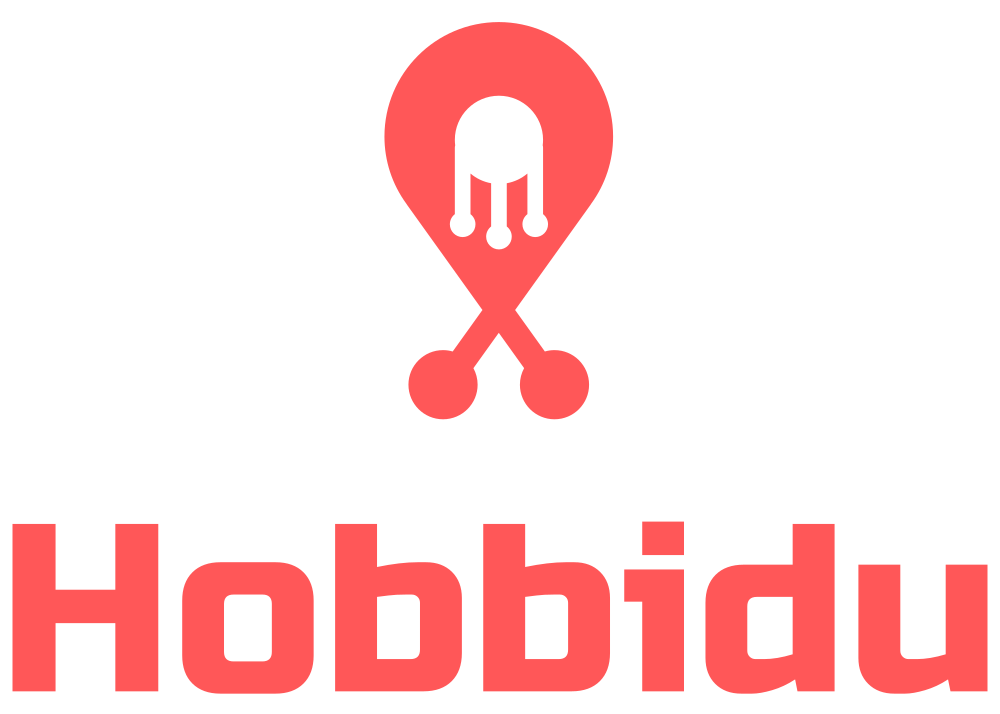
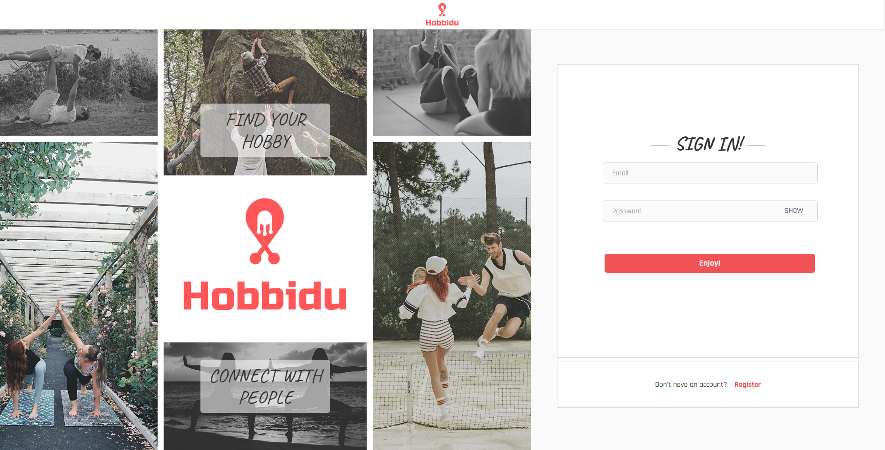
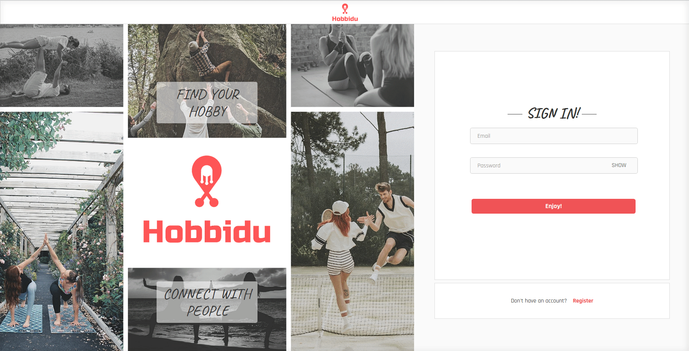
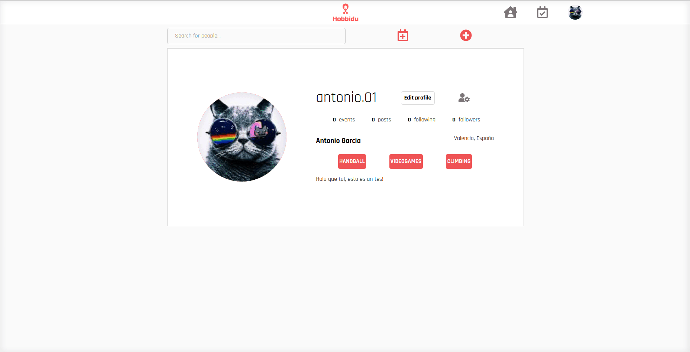
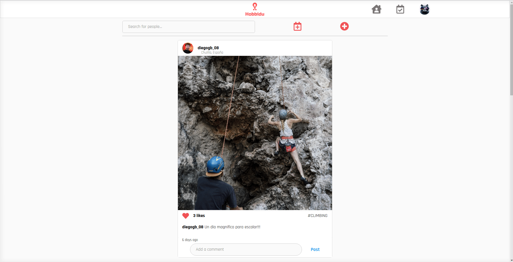
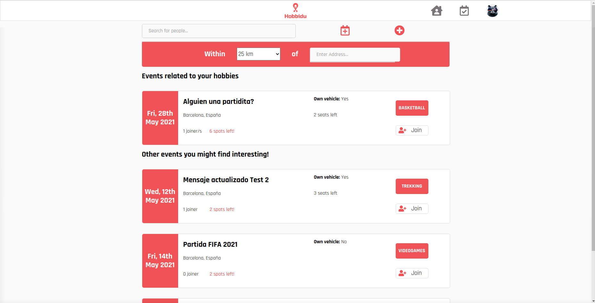

<!-- PROJECT LOGO -->
<br />
<p align="center">
    

<h4 align="center">Find your Hobby!</h4>

<h4 align="center">Connect with People!</h4>
  <p align="center">
    <a href="https://hobbidu.herokuapp.com/">View Web Application</a>
  </p>
</p>

<!-- TABLE OF CONTENTS -->
<details open="open">
  <summary>Table of Contents</summary>
  <ol>
    <li>
      <a href="#installation">Installation</a>
    </li>
    <li>
      <a href="#about-the-project">About The Project</a>
    </li>
    <li>
      <a href="#app-overview">Overview</a>
    </li>
    <li><a href="#languages-and-tools">Languages and Tools</a></li>
    <li><a href="#license">License</a></li>
    <li><a href="#repositories">Repositories</a></li>
    <li><a href="#contact">Contact</a></li>
  </ol>
</details>

## Installation

###### Frontend

Install the dependencies and devDependencies for the frontend repository.

```sh
npm i
```

In the project directory, you can run:

```sh
npm start
```

And if you wish, you can run the scss

```sh
npm run scss
```

###### Backend

Install the dependencies and devDependencies for the backend repository.

```sh
npm i
```

In the project directory, you can run:

```sh
npm run start
```

On the other side you will need to add the enviroments to run your own MongoDB database.

<!-- ABOUT THE PROJECT -->

## About The Project

Hobbidu is Full-Stack MERN web application that allows users to connect and meet with other people with a common hobby through events created by themselves. In this application, the users will be able to filter the events by distance to the wanted location. On top of this, they will be able to post and comment their hobbies routine.

The back end of the application was built with [Nodejs](https://nodejs.org/), [Mongoose](https://mongoosejs.com/) and [MongoDB](https://www.mongodb.com/) database. All data fetching was done using [Express](https://expressjs.com/) and [Axios](https://github.com/axios/axios) for declaring JSON structures. For the image handling, the web application is using [Multer](https://www.npmjs.com/package/multer), [fs-extra](https://www.npmjs.com/package/fs-extra) and [AWS S3 Bucket](https://aws.amazon.com/s3/) where we store all the pictures in a safe way.

The front end was created with [Reactjs](https://es.reactjs.org/) and [JavaScript](https://developer.mozilla.org/es/docs/Web/JavaScript) and uses the [Redux](https://es.redux.js.org/) architectural framework for an optimal single-page user-experience.

The backend and the frontend of the project are deployed in [Heroku](https://id.heroku.com/) through the `master` branch.

#### Authentication page

Back-end and front-end user authentication was built from scratch by encrypting user password with [Bcryptjs](https://www.npmjs.com/package/bcryptjs) and creating a unique session token with [JSONWebToken](https://www.npmjs.com/package/jsonwebtoken) for each user on sign up or login. This allows for secure access to one's account on the single-page application which then renders distinct content based on the current user.

#### Future Features:

- Direct messages between users.
- Display all user post at their own profile.
- Posibility to upload videos as well.
- Live Chat
- Create React Native App
- Push Notifications

<a href="https://hobbidu.herokuapp.com/" target="_blank">
    
</a>

<!-- OVERVIEW -->

## APP OVERVIEW

###### Registration & Login


<br>
<br>

###### Login and User profile update



<br>
<br>

###### Edit hobbies, change email & password and logaout



<br>
<br>

###### Follow users


<br>
<br>

###### Filter events by location and distance



<br>
<br>

###### Create event



<br>
<br>

###### Create post


<br>
<br>

---

## Languages and Tools:

<p align="left">
    <a href="https://aws.amazon.com/" target="_blank"> 
        
    </a> 
    <a href="https://sass-lang.com/" target="_blank"> 
        
    </a> 
    <a href="https://www.w3schools.com/css/" target="_blank"> 
        
    </a> 
    <a href="https://expressjs.com" target="_blank"> 
        
    </a>
    <a href="https://git-scm.com/" target="_blank">
        
    </a>
    <a href="https://www.w3.org/html/" target="_blank">
        
    </a>
    <a href="https://developer.mozilla.org/en-US/docs/Web/JavaScript" target="_blank">
        
    </a>
    <a href="https://www.mongodb.com/" target="_blank"> 
        
    </a>
    <a href="https://nodejs.org" target="_blank">
         
    </a>
    <a href="https://postman.com" target="_blank">
        
    </a>
    <a href="https://reactjs.org/" target="_blank">
        
    </a>
    <a>
        
    </a>
    <a>
        
    </a>
    <a>
        
    </a>
    <a>
        
    </a>
    <a>
        
    </a>
</p>

<!-- LICENSE -->

## License

Distributed under the MIT License. See `LICENSE` for more information.

<!-- LINKS TO REPOSITORIES -->

## Repositories

- [Hobbidu-frontend](https://github.com/diegogb-08/Hobbidu-frontend)
- [Hobbidu-backend](https://github.com/diegogb-08/Hobbidu-backend)

<!-- CONTACT -->

## Contact

- Diego García
  - [GitHub](https://github.com/diegogb-08)
  - [LinkedIn](https://www.linkedin.com/in/diego-garcia-brisa/)
